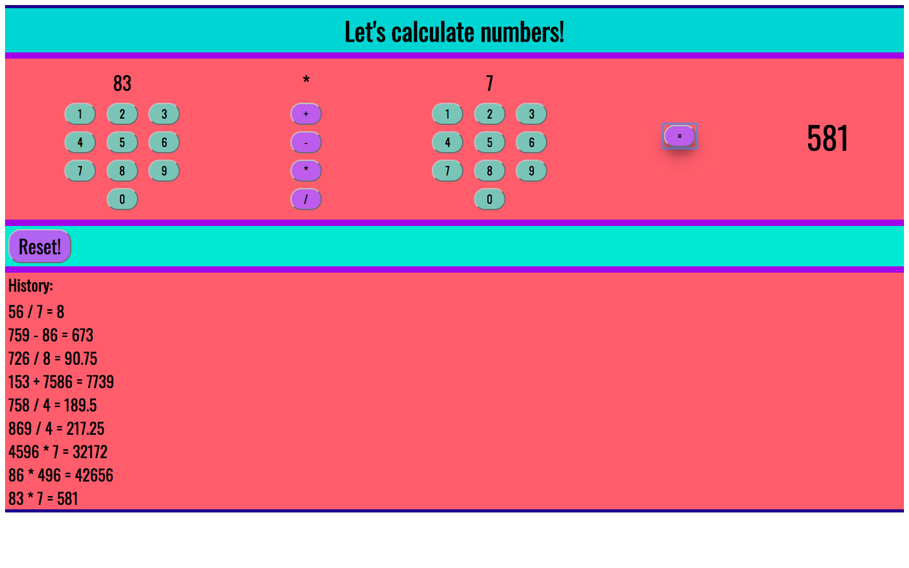

# Weekend Challenge 2: Calculator

## Project Description 

Users can calculate numbers with this calculator app. Users can also view their calculation history. 

## Technologies Used

- jQuery
- node.js
- Express

## Screen Shot

## Completed Features
- Users can add, subtract, divide and multiply numbers
- Users can view their calculation history
